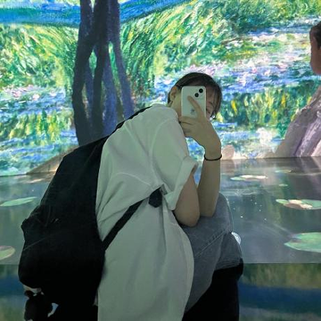

# 하이브리드정각세

## 팀원 소개

| 주효정                      | 최수연                      | 김성진                      | 배정우                      |
| --------------------------- | --------------------------- | --------------------------- | --------------------------- |
|  |  |  |  |
| FE                          | FE                          | BE                          | BE                          |
| [@jhj2713](https://github.com/jhj2713)       | [@sooyeoniya](https://github.com/sooyeoniya)       | [@k000927](https://github.com/k000927)                    | [@wjddn2165](https://github.com/wjddn2165)                |

## 협업 전략

### 브랜치 컨벤션

```md
feat: 기능 구현
chore: 사소한 변경 사항
design: 스타일(css) 변경
refactor: 리팩토링
fix: 오류 수정
docs: 문서 작성
```

### 폴더 구조

```jsx
└── src
    ├── apis
    │   └── badgeAPI.ts
    ├── components
    │   └── Header
    │       └── index.tsx
    ├── constants
    │   └── log.ts
    │   └── color.ts
    ├── contexts
    │   └── badgeContext.tsx
    ├── hooks
    │   └── useFetch.tsx
    ├── pages
    │   └── Main
    │       └── index.tsx
    ├── types
    │   └── badge.ts
    └── utils
        └── badge.ts
```

### 커밋 템플릿

```md
## 🖥️ Preview

close #{issue number}

## ✏️ 한 일

## ❗️ 발생한 이슈 (해결 방안)

## ❓ 논의가 필요한 사항
```

### 이슈 템플릿

```md
## 🖥️ 어떤 기능인가요?

## ✏️ 작업 상세 내용

## ❗️ 참고 자료 (선택)
```

```md
## 🖥️ 어떤 버그인가요?

## ❗️ 참고 자료 (선택)
```

## 그라운드 룰

### 소통과 피드백 💬

1. **반대 의견을 두려워하지 말기**
   - 의견에 반대할 때에는 ‘좋은 의견입니다’ + ‘이 의견이 좋은 이유’ 말하고 시작하기
   - _~~(인프피과다그룹)~~_
2. **어려움은 솔직하게 공유하기**
   - 불편함이 느껴지면 곧바로 공유하기
   - 상처받았으면 상처받았다고 말하고 사과하기
3. **편안한 커뮤니케이션을 위해 노력하기**
   - 경청하기
   - 생각하고 말하기
4. **온라인 커뮤니케이션**
   - 업무 메시지는 무조건 두괄식
   - 메시지를 읽으면 이모지 남기기

### 약속과 시간 관리 ⏰

1. **시간 약속은 꼭 지키기**
   - 회의 시간에 3분 이상 늦으면 팀 내 1명에게 랜덤으로 커피 쿠폰 쏘기
   - 지키기 어려울 때는 최대한 빠르게 알리기
2. **회의가 길어질 경우 잠시 휴식을 취하고, 유동적으로 시간 관리하기**

### 회의 효율성 📄

1. **회의의 목표를 분명히 하기**
   - 목표를 모두가 공유하고 시작하기
   - 회의가 끝났을 때에는 결과가 있을 것 (아이디어, 의사 결정, Action Item)
   - _~~"아무쪼록 다같이 열심히 해봐요 ^\_\_\_^ ” 금지~~_
2. **회의록 잘 관리하기**
   - 회의록 꼭 작성하고 공유하기
   - 회의 진행자는 회의 아젠다를 회의록에 미리 정리하기
   - 회의 참여자는 아젠다 체크하고 이모지로 확인하기

### 팀 문화 🥰

- 웃으며 일하기!
- 프로덕트의 비전과 미션을 주기적으로 상기
- 친해지기 위해 노력하기. (밥 같이 먹기 등)

## 회의록

[notion](https://www.notion.so/bside/0bdf55edcf9f417b8536803cac02339d)

## 기획 링크

[Figma](https://www.figma.com/design/RjcSZf0akqXegZpLM400IJ/Handoff_%ED%95%98%EC%9D%B4%EB%B8%8C%EB%A6%AC%EB%93%9C%EC%A0%95%EA%B0%81%EC%84%B8?node-id=0-1&t=k82334z7qujXpsBD-1)

## 디자인 링크

[Figma](https://www.figma.com/design/rt4g2VwFF4icjxvj7ZFG0W/Design?node-id=39-21&t=zY12rmKl2QrujAhA-1)

## Git Project

[github](https://github.com/orgs/softeerbootcamp4th/projects/8)

## 노션
[notion](https://www.notion.so/bside/0f847f8e83e9423394eeb95e460a0840?pvs=4)
